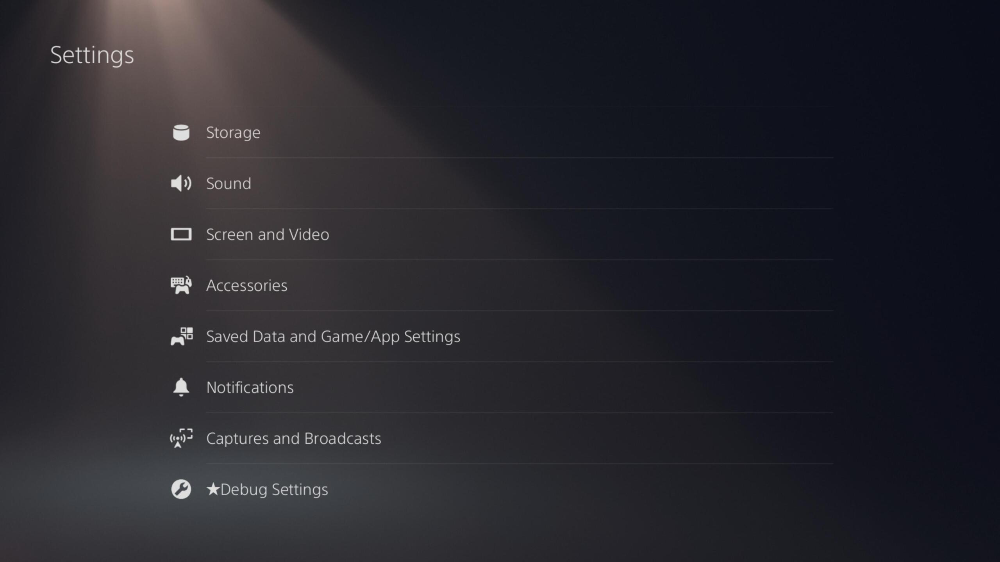

### Installing etaHEN (Method 1)

1. Open the Setting menu on your PS5
1. Click on User's Guide, Health & Safety, and Other Information > User's Guide > User's Guide
1. Scroll down and click the playstation.com/system-software/ link
1. Scroll down until you see a YouTube embed, click the YouTube icon on it
1. Head over to the Sign In button at the top right of the YouTube page, then click on the Privacy button at the bottom
1. Scroll all the way down and then click the Google button at the bottom bar, you should now see a Google Search page in your browser
1. Click on the Search bar and type in "es7in1.site", then open the first search result
1. From here, the PS5 3.XX/4.XX Hosts page should automatically load, click on the idlesauce link at the bottom right
1. Click on the Jailbreak button
    - If you see the "There's not enough free system memory." popup, simply click OK and then retry the jailbreak
1. Once the exploit is successful, click on the etaHEN option at the top left

### Installing etaHEN (Method 2)

1. Open the Setting menu on your PS5
1. Open the Network settings page
1. Scroll down to Settings and then select Set Up Internet Connection 
1. Select your connection and click Advanced Settings
1. Head over to DNS Settings and set them to Manual
    - Set the Primary DNS to either 192.241.221.79 or 165.227.83.145
1. Click OK and wait for the console to connect
1. Go back to the main Settings page, and go to User's Guide, Health & Safety, and Other Information > User's Guide > User's Guide
   - If you see the normal User's Guide page, Log Off your user and Log back In to refresh the browser
1. Press the Left Trigger (L2) twice to bring up the URL Redirector
1. Type in "es7in1.site", then click the Submit button
1. From here, the PS5 3.XX/4.XX Hosts page should automatically load, click on the idlesauce link at the bottom right
1. Click on the Jailbreak button
    - If you see the "There's not enough free system memory." popup, simply click OK and then retry the jailbreak
1. Once the exploit is successful, click on the etaHEN option at the top left

You should see a popup on your PS5 showing the FTP, Klog and ELF Loader ports, as well as the etaHEN version. This means that the jailkbreak has been successful. In the Settings application, you should be able to see Debug Settings at the bottom. If you can't see this, try running the exploit again.

## Continue to [Installing itemzflow](installing-itemzflow.md)