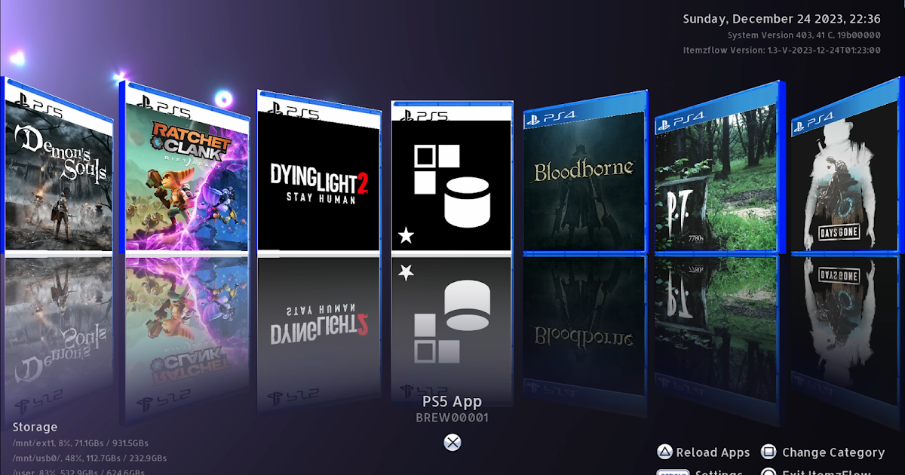

### Installing itemzflow

## What you need

- A computer
- An exFAT formatted USB storage device

## Instructions

### Section I - Preparing the USB

1. Go to [PKG-Zone](https://pkg-zone.com/) and grab the latest PS5 version
    - [Direct Link](https://pkg-zone.com/download/ps5/ITEM00001/latest)
1. Safely eject the USB and insert it in your PS5
1. Head over to Settings > Debug Settings > Game
    - Ignore the "Something went wrong." error by pressing OK
1. From here, go to Package Installer and install the itemzflow package file
    - Repeat these steps with any other PS5 Homebrew app if you wish

## [↩ Get Started](../README.md)

## [↩ Installing etaHEN](installing-etahen.md)
